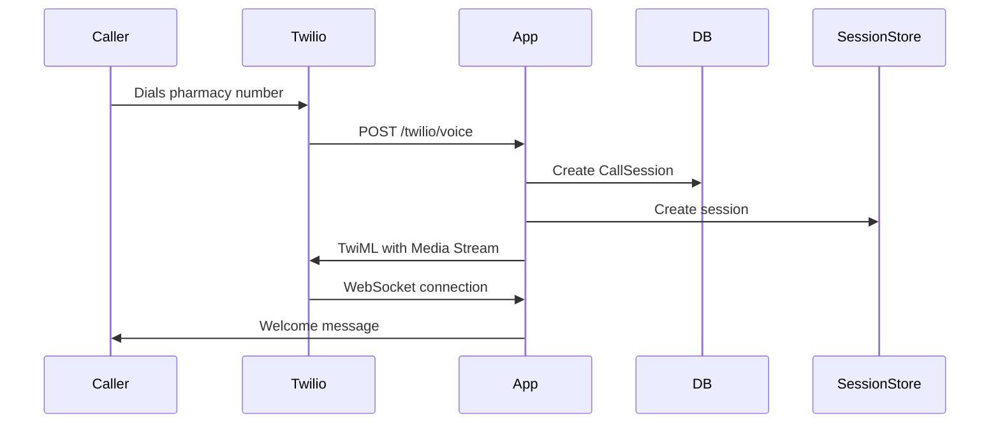
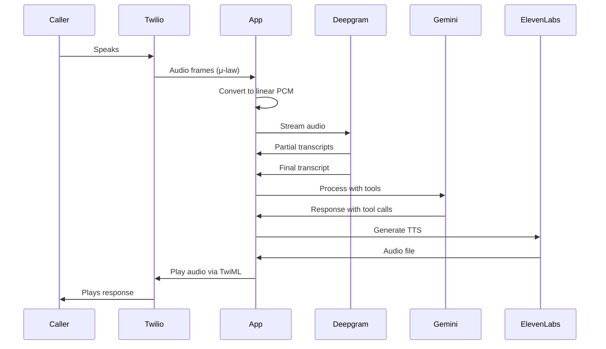
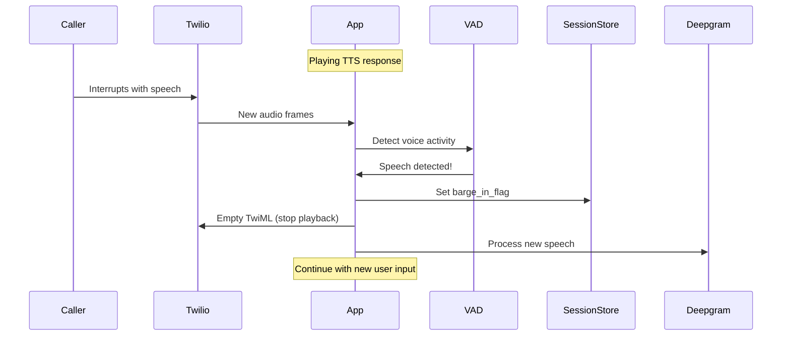

# Pharmacy Voice Agent Architecture

## System Overview

The Pharmacy Voice Agent is a real-time voice processing system that handles prescription refills, drug interaction checks, and administration guidance through phone calls via Twilio.

## High-Level Architecture

```
┌─────────────────┐    ┌──────────────────┐    ┌─────────────────┐
│   Twilio Voice  │    │   FastAPI App    │    │   AI Services   │
│                 │    │                  │    │                 │
│ • Incoming Call │───▶│ • Webhook Handlers│───▶│ • Deepgram STT  │
│ • Media Streams │    │ • WebSocket Server│    │ • Gemini LLM    │
│ • Call Control  │◀───│ • Static Files   │◀───│ • ElevenLabs TTS│
└─────────────────┘    └──────────────────┘    └─────────────────┘
                              │
                              ▼
                       ┌──────────────┐
                       │   Database   │
                       │              │
                       │ • Sessions   │
                       │ • Patients   │
                       │ • Audit Logs │
                       └──────────────┘
```

## Media Flow Sequence

### Call Initiation



### Real-time Audio Processing



### Barge-in Handling



## Component Architecture

### 1. FastAPI Application (`server/app.py`)
- **Webhook Endpoints**: Handle Twilio voice webhooks
- **WebSocket Server**: Media Streams endpoint
- **Static File Serving**: TTS audio files with signed URLs
- **Middleware**: CORS, PHI protection, request validation

### 2. Media Stream Handler (`server/ws_media.py`)
- **WebSocket Management**: Per-call connection handling
- **Audio Processing**: μ-law to PCM conversion, resampling
- **Voice Activity Detection**: Barge-in detection
- **Session Coordination**: Manages call state and conversation flow

### 3. Speech-to-Text (`server/stt/deepgram_client.py`)
- **Streaming STT**: Real-time transcription with interim results
- **Connection Management**: Per-call Deepgram connections
- **Error Recovery**: Automatic reconnection on failures
- **Utterance Detection**: End-of-speech detection

### 4. Language Model (`server/llm/gemini_client.py`)
- **Tool-enabled LLM**: Gemini with function calling
- **Domain Tools**: Refill, interaction check, administration guide
- **Conversation Management**: Context-aware responses
- **Safety Controls**: Content filtering and scope limiting

### 5. Text-to-Speech (`server/tts/elevenlabs_client.py`)
- **High-quality TTS**: ElevenLabs voice synthesis
- **Chunked Processing**: Split responses for better barge-in
- **File Management**: Local storage with cleanup
- **Signed URLs**: Secure file serving

### 6. Domain Services
- **Drug Info Service** (`server/domain/drug_info/`): Interaction checking and administration guidance
- **Refill Service** (`server/domain/refill/`): Prescription refill processing
- **Session Store** (`server/domain/sessions/`): In-memory call state management

### 7. Persistence Layer (`server/persistence/`)
- **SQLAlchemy Models**: Database schema
- **Session Management**: Database connections
- **Audit Logging**: PHI-protected event logging

## Data Flow

### 1. Audio Processing Pipeline
```
Caller Speech → Twilio (8kHz μ-law) → App (PCM conversion) → Deepgram (16kHz) → Transcript
```

### 2. Response Generation Pipeline
```
User Transcript → Gemini LLM → Tool Calls → Domain Services → Response Text → ElevenLabs → Audio File → Twilio
```

### 3. Barge-in Pipeline
```
Ongoing TTS → Voice Activity Detection → Stop Playback → Process New Speech → Continue Conversation
```

## Session State Management

### Session Lifecycle
1. **Creation**: On incoming call
2. **Identity Verification**: Before PHI access
3. **Active Processing**: During conversation
4. **Barge-in States**: When user interrupts
5. **Completion**: Call ends
6. **Cleanup**: Resource cleanup

### State Transitions
```
ACTIVE ↔ IDENTITY_PENDING ↔ IDENTITY_VERIFIED
   ↓           ↓                    ↓
PROCESSING → BARGE_IN → ACTIVE → COMPLETED
```

## Security and Privacy

### PHI Protection
- **Data Masking**: Phone numbers, DOB, names in logs
- **Audit Logging**: All PHI access events tracked
- **Session Tokens**: Short-lived authentication
- **Signed URLs**: Secure TTS file access

### Request Validation
- **Twilio Signatures**: Webhook request validation
- **CORS Controls**: Restricted origin access
- **Rate Limiting**: (Can be added) Prevent abuse

## Scalability Considerations

### Current Architecture
- **Single Instance**: In-memory session store
- **Local File Storage**: TTS files on disk
- **SQLite Database**: Simple persistence

### Scaling Options
- **Redis Session Store**: Distributed session management
- **S3/Cloud Storage**: Scalable TTS file storage
- **PostgreSQL**: Production database
- **Load Balancing**: Multiple app instances
- **WebSocket Sticky Sessions**: Required for Media Streams

## Error Handling and Recovery

### Failure Modes
1. **Deepgram Connection Loss**: Auto-reconnect with fallback to Twilio STT
2. **LLM Service Errors**: Graceful fallback responses
3. **TTS Generation Failures**: Fallback to Twilio Say
4. **Database Errors**: Continue with in-memory state
5. **WebSocket Disconnections**: Clean resource cleanup

### Monitoring Points
- Active session count
- STT/TTS success rates
- Response latency
- Error rates by component
- PHI access events

## Development and Testing

### Local Development
1. **ngrok**: Expose local server to Twilio
2. **Environment Variables**: Configuration via .env
3. **Database Seeding**: Test data for development
4. **Debug Mode**: Enhanced logging and audio storage

### Testing Strategy
- **Unit Tests**: Individual component testing
- **Integration Tests**: End-to-end call flows
- **Load Testing**: Concurrent call handling
- **Security Testing**: PHI protection validation
